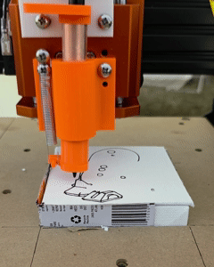

# KeyNC
## Gcode controller based on keyboard input
This application connects to any GRBL-firmware capable CNC machine and sends and activates GCodes when certain inputs are used. 

This has been tested with a VEVOR CNC router that included a custom 3-D printed carriage that held a marker and a solenoid wired into the laser input. Instead of etching into wood, our machine drew on either ceramic or canvas tiles. We showcased at the Utah Arts Festival in partnership with [Make Salt Lake](https://makesaltlake.org/), a non-profit makerspace based in Salt Lake City, UT.

Built with Python and [GRBLStreamer](https://github.com/michaelfranzl/grbl-streamer).